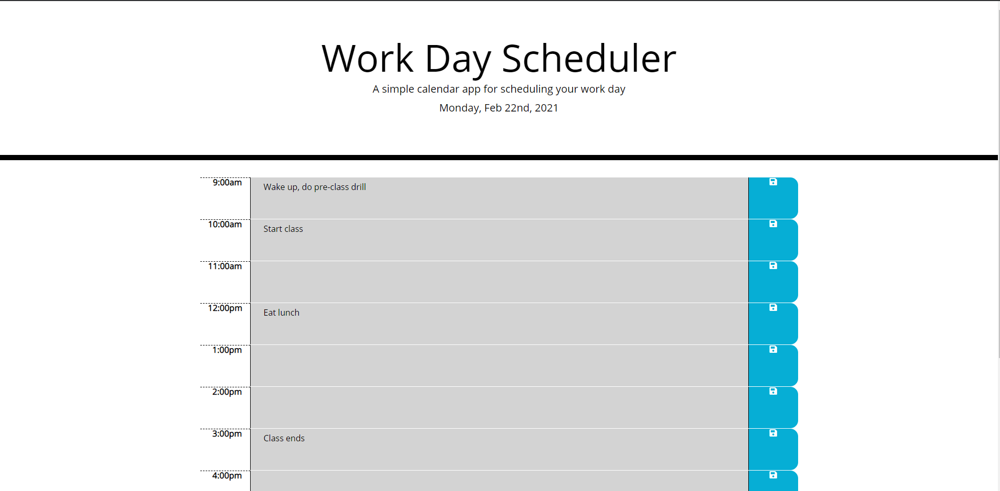
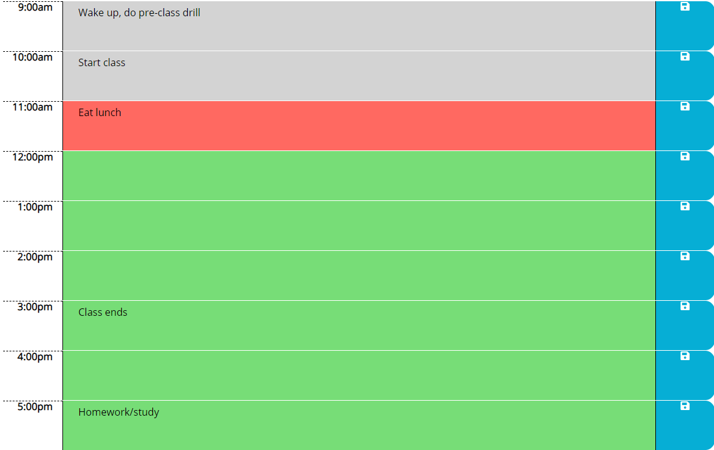
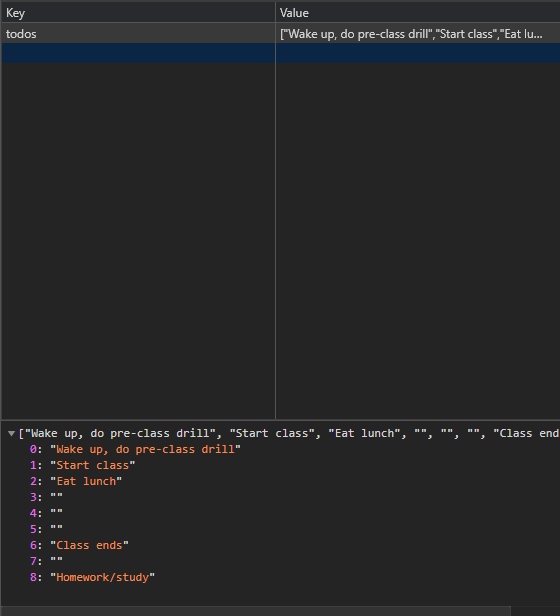

# Ch5-DayPlanner

## Table of Contents

<br>

[Description](#description)

[Usage](#Usage)

[Criteria](#criteria)

<br>

## Description

<br>

This project allows the user to manage their time using color-coded time blocks that can be filled in with text. The colors of the blocks change depending on what hour of the day it is. Blocks in the past will be grey, blocks in the future will be green, and the present block will be red. You can click on any block to insert text inside of it, and then click the save button to save the information to local storage. If you refresh the page, the information will still be there. If you want to update the information, simply change the text and save it again. Also, the date will be displayed at the top in the header.

This project helped me practice both JQuery and moment.js. It was a lot of fun working with moment to manipulate the time blocks depending on what time of day it is. The most difficult part of working on this project was figuring out how to save all the data in the time blocks into local storage and being able to grab that same data later. I solved this by splicing the data to an array, using a for loop to assign each row to a different index. To recieve the data, I used a similar method to change the value of the textareas to the values that were in the array.


<br>
<br>


## Usage
<br>
To access the website, go to https://ngkent75.github.io/Ch5-DayPlanner/

<br>
This project uses a table to assist the user in planning their schedule. The date will be displayed at the top.
<br>



<br>
You can enter text into any of the blocks. The blocks will be colored based on the time of day. Grey means that it's in the past, red means it is in the present, and green means it is in the future.
<br>




<br>


Click the blue button to save the data. The data will be saved to local storage, and will be pulled when you revisit the page. Try refreshing, the text will stay there. If you want to change the data that's stored, change the text in the textareas and save again. The local storage will update.
<br>


<br>


<br>

## Criteria

<br>

```md
GIVEN I am using a daily planner to create a schedule
WHEN I open the planner
THEN the current day is displayed at the top of the calendar
WHEN I scroll down
THEN I am presented with timeblocks for standard business hours
WHEN I view the timeblocks for that day
THEN each timeblock is color coded to indicate whether it is in the past, present, or future
WHEN I click into a timeblock
THEN I can enter an event
WHEN I click the save button for that timeblock
THEN the text for that event is saved in local storage
WHEN I refresh the page
THEN the saved events persist
```